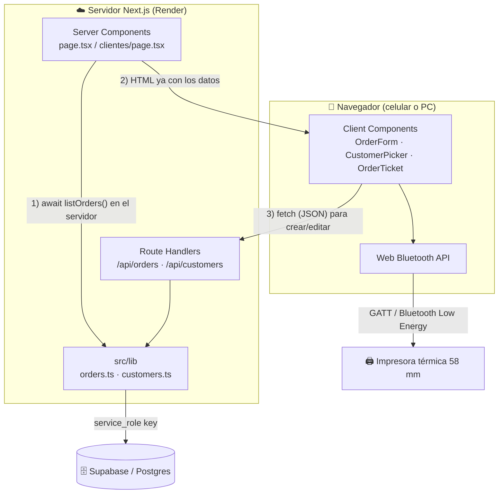
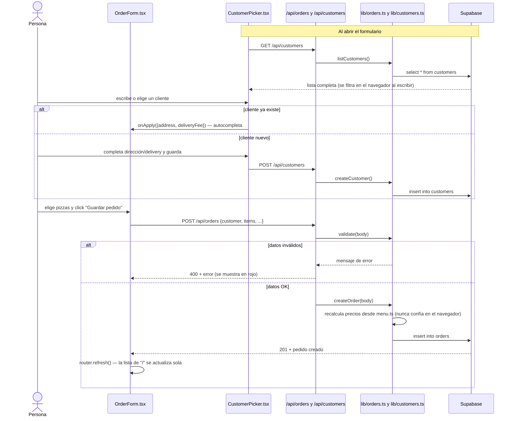
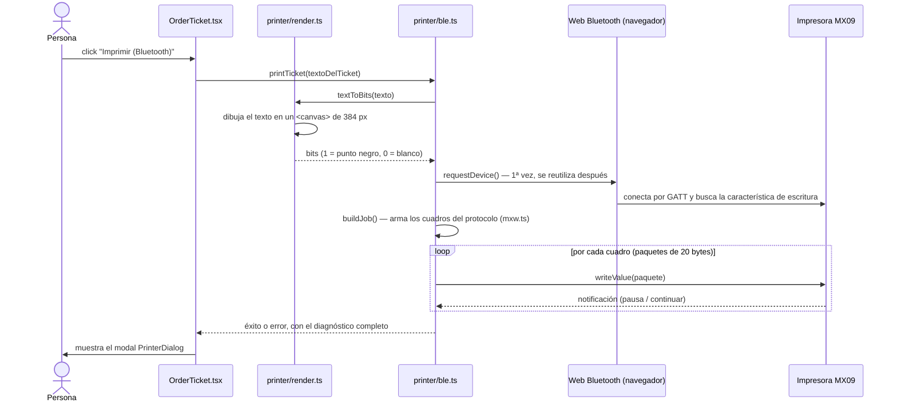

# Arquitectura del proyecto

Guía para entender cómo está armado el código y cómo fluyen los datos. Pensada
para alguien que recién empieza con Next.js: los diagramas se ven con formato
en GitHub, en VS Code (con la extensión "Markdown Preview Mermaid Support" o
similar) o pegándolos en <https://mermaid.live>.

## 1. Server Components vs Client Components (lo más importante de Next.js)

Este proyecto usa el **App Router** de Next.js (la carpeta `src/app`). Cada
archivo `.tsx` de ahí adentro es uno de estos dos tipos, y la diferencia es
central para entender todo lo demás:

| | **Server Component** (por defecto) | **Client Component** (`"use client"` al principio del archivo) |
|---|---|---|
| ¿Dónde corre? | En el servidor (Node), nunca llega al navegador | En el navegador, como React normal |
| ¿Puede usar `useState`, `useEffect`, `onClick`? | ❌ No | ✅ Sí |
| ¿Puede hacer `await` directo a la base de datos? | ✅ Sí (`await listOrders()`) | ❌ No (tiene que usar `fetch` a una API) |
| Ejemplos en este proyecto | `page.tsx`, `clientes/page.tsx`, `layout.tsx` | `OrderForm.tsx`, `CustomerPicker.tsx`, `CustomerManager.tsx`, `OrderTicket.tsx` |

Un Server Component puede renderizar Client Components (así arma sus pantallas
`page.tsx`). Al revés no se puede. Por eso todo lo interactivo (formularios,
botones, Bluetooth) quedó en componentes separados con `"use client"`.

## 2. Estructura de carpetas

```
Pizzeria/
├── src/
│   ├── app/                     # Rutas: cada carpeta = una URL (file-based routing)
│   │   ├── layout.tsx            # Envuelve TODA la app (<html>, <body>, fuentes, <title>)
│   │   ├── page.tsx              # "/" — pedidos: formulario + lista (Server Component)
│   │   ├── globals.css           # Estilos globales (Tailwind)
│   │   ├── clientes/
│   │   │   └── page.tsx          # "/clientes" — gestor de clientes (Server Component)
│   │   └── api/                  # Route Handlers: no devuelven HTML, devuelven JSON
│   │       ├── orders/route.ts           # GET y POST /api/orders
│   │       └── customers/
│   │           ├── route.ts              # GET y POST /api/customers
│   │           └── [id]/route.ts         # PATCH /api/customers/:id ([id] = ruta dinámica)
│   │
│   ├── components/               # Piezas de interfaz, todas "use client"
│   │   ├── OrderForm.tsx         # Formulario para crear un pedido
│   │   ├── OrderTicket.tsx       # Un pedido ya creado: texto + botones de acción
│   │   ├── PrinterDialog.tsx     # Modal de resultado al imprimir
│   │   ├── CustomerPicker.tsx    # Buscador de clientes, dentro del formulario
│   │   ├── CustomerManager.tsx   # Lista + alta/edición de clientes en /clientes
│   │   └── CustomerFields.tsx    # Los 3 campos de un cliente (nombre/dirección/delivery)
│   │
│   └── lib/                      # Lógica pura (sin JSX): el "backend" del proyecto
│       ├── types.ts              # Tipos de TypeScript compartidos por todo el código
│       ├── menu.ts                # Sabores de pizza y sus precios (única fuente de verdad)
│       ├── format.ts              # Arma el texto del ticket, con columnas alineadas
│       ├── supabase.ts            # Cliente de Supabase — SOLO se importa en el servidor
│       ├── orders.ts              # Todo el CRUD de pedidos contra la tabla `orders`
│       ├── customers.ts           # Todo el CRUD de clientes contra la tabla `customers`
│       └── printer/
│           ├── mxw.ts             # Protocolo binario de la impresora térmica (bytes, CRC8)
│           ├── render.ts          # Dibuja el ticket como imagen en un <canvas>
│           └── ble.ts             # Conexión Bluetooth (Web Bluetooth API) con la impresora
│
├── supabase/
│   └── schema.sql                 # SQL para crear las tablas `orders` y `customers`
│
├── .env                           # Claves de Supabase (nunca se sube a git)
├── render.yaml                    # Configuración de despliegue en Render
└── package.json
```

**Regla que se repite en todo el proyecto:** los componentes nunca hablan con
Supabase directamente. Siempre es `componente → fetch → Route Handler (API) →
lib/orders.ts o lib/customers.ts → Supabase`. Así, la validación y el cálculo
de precios viven en un solo lugar (el servidor) y nadie puede manipularlos
editando el HTML o la petición desde el navegador.

## 3. Arquitectura general



## 4. Flujo: crear un pedido (con autocompletar de cliente)



## 5. Flujo: imprimir por Bluetooth



## 6. Sondeo ("tiempo real" sin WebSockets)

`CustomerManager.tsx` vuelve a pedir `/api/customers` cada 5 segundos
(`setInterval` dentro de un `useEffect`). Es una forma simple de que, si se
edita un cliente desde otro teléfono, los demás lo vean reflejado sin recargar
la página, sin necesitar infraestructura de WebSockets (Supabase Realtime)
todavía.
